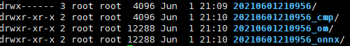
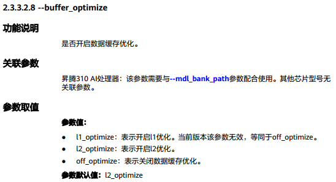

# 简介

一步式精度比对工具。基于[《 CANN 5.0.1 开发辅助工具指南 (推理) 01.pdf》](https://cmc-szv.clouddragon.huawei.com/cmcversion/index/releaseView?deltaId=3696745162342656&isSelect=inner&url_data=CANN%E8%B5%84%E6%96%99%3E%E6%A0%87%E5%87%86%E6%80%81%3Ezh%3E%E6%8E%A8%E7%90%86)的 **《7 精度比对工具使用指南》** ，串起流程，只需一步操作即可生成中间dump数据、对比结果Excel文件。

# 准备工作

- 需要提前准备[msame](https://gitee.com/ascend/tools/tree/master/msame#https://gitee.com/ascend/tools.git)工具。本代码仓提供编译好的，在`msame`文件夹下，根据自己的系统获取对应版本。若无法使用，则需要用户自己重新编译。

# 如何使用？

1、根据实际情况修改`config.yaml`文件，例如：

```yaml
input_info:
  - bin_path: ./input_data/0.bin
    shape: (1, 3, 224, 224)
    dtype: np.float32
    input_name: image
om_path: ./wide_resnet50_2_bs1.om
onnx_path: ./wide_resnet50_2.onnx
dump_save_path: ./dump_data
npu_device_id: 0
msame_path: ./msame/x86/msame
msaccucmp_py_path: /usr/local/Ascend/ascend-toolkit/latest/x86_64-linux/toolkit/tools/operator_cmp/compare/msaccucmp.py
env: |
  export install_path=/usr/local/Ascend/ascend-toolkit/latest
  export PATH=/usr/local/python3.7.5/bin:${install_path}/atc/ccec_compiler/bin:${install_path}/atc/bin:$PATH
  export PYTHONPATH=${install_path}/atc/python/site-packages:$PYTHONPATH
  export LD_LIBRARY_PATH=${install_path}/atc/lib64:${install_path}/acllib/lib64:$LD_LIBRARY_PATH
  export ASCEND_OPP_PATH=${install_path}/opp
```

**参数说明&注意事项：**

- bin_path：模型的输入数据
- shape：此输入数据的维度，写成python tuple格式
- dtype：此输入数据的类型，numpy类型写法，写成np.float32，np.int32，...，不可写成numpy.float32，numpy.int32，...
- input_name：此输入数据对应的onnx模型的输入名字
- 若模型有多个输入，input_info数组一定要按照onnx模型图中的输入顺序提供，不可颠倒顺序，否则dump出的om数据不可靠，甚至无法dump出om数据
- npu_device_id：所用的npu设备id，**若运行出现卡死，说明npu设备正在被使用，尝试使用其它设备**
- 新版cann toolkit中的`msaccucmp.pyc`已改为`msaccucmp.py`
- env：cann toolkit环境变量

2、输入如下命令，开始生成dump数据并对比：

```shell
python one_step_accuracy_cmp.py config.yaml
```

**dump生成的目录说明：**



- 20210601210956：om模型dump出的原始数据
- 20210601210956_om：om模型dump出的原始数据转numpy后的数据
- 20210601210956_onnx：onnx模型的dump数据
- 20210601210956_cmp：比对报告CSV文件存放目录

# 特别说明（必看）

若从对比excel文件，或者**20210601210956_om**目录中发现om的dump数据都为0，或者感觉om dump出的数据比较奇怪，感觉不正确，那么atc转om的时候加上`--buffer_optimize=off_optimize`关闭数据缓存优化，再运行一遍，看结果是否符合预期。

缓存优化默认是开启的，有些om在开启缓存优化后dump出的数据都是0，而有些om的某些节点dump出的数据是0，导致比对结果看起来不正常。

个人建议，先不关闭缓存优化，对比一遍，然后再关闭缓存优化对比一遍，比较两次得到的Excel文件。

